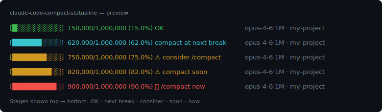

# claude-code-compact-statusline

A minimal [Claude Code](https://docs.claude.com/en/docs/claude-code/overview) statusline that shows context token usage **with stage-based guidance on when to run `/compact`**.

Unlike generic token-percentage statuslines, each threshold maps to an actionable hint — so you know not just *how full* the context is, but *what to do about it*.



## Why

Claude Code auto-compacts near ~90–95% of the context window, but by then quality suffers. Running `/compact` **manually at a natural break point** produces much cleaner summaries. This statusline nudges you at the right moments instead of letting you hit the cliff.

## Stages

| Usage     | Label                          | Meaning                                  |
| --------- | ------------------------------ | ---------------------------------------- |
| `<50%`    | 🟢 `OK`                        | Plenty of headroom                       |
| `50–70%`  | 🔵 `compact at next break`     | Good time once current task wraps up     |
| `70–80%`  | 🟡 `⚠ consider /compact`       | Start looking for a stopping point       |
| `80–85%`  | 🟡 `⚠ compact soon`            | Don't start new large work               |
| `85%+`    | 🔴 `/compact now`              | Run it before auto-compact triggers      |

The bar, percentage, and raw token count are always shown.

## Install

1. Save `statusline.py` to `~/.claude/statusline.py`.

2. Add this block to `~/.claude/settings.json`:

   ```json
   {
     "statusLine": {
       "type": "command",
       "command": "python ~/.claude/statusline.py"
     }
   }
   ```

   On Windows, if `~` expansion gives you trouble, use the full path:
   ```json
   "command": "python \"C:\\Users\\<you>\\.claude\\statusline.py\""
   ```

3. Restart Claude Code.

Requires Python 3.6+.

## How it works

The script reads the session transcript (`transcript_path` passed in via JSON on stdin) and sums `input_tokens + cache_read_input_tokens + cache_creation_input_tokens` from the latest assistant turn with a `usage` field. That sum is the real context size Claude sees.

Model limit is inferred from the model ID — a `[1m]` suffix maps to the 1M long-context beta, otherwise 200k. Add your own entries to `MODEL_LIMITS` if needed.

## Customizing

- **Thresholds**: edit the `stage()` function.
- **Labels / language**: same place — translate to your language, change the wording, add emoji.
- **Bar width**: `bar(pct, width=10)`.
- **Context limits**: extend `MODEL_LIMITS`.

## Alternatives

If you just want a token percentage without the compaction guidance, these are more full-featured:

- [ccstatusline](https://github.com/sirmalloc/ccstatusline) — powerline themes, highly customizable
- [ClaudeCodeStatusLine](https://github.com/daniel3303/ClaudeCodeStatusLine) — color thresholds
- [CCometixLine](https://github.com/Haleclipse/CCometixLine) — Rust, fast
- [claude-powerline](https://github.com/Owloops/claude-powerline) — vim-style

This project's niche is specifically the **staged compaction hints**.

## License

MIT
